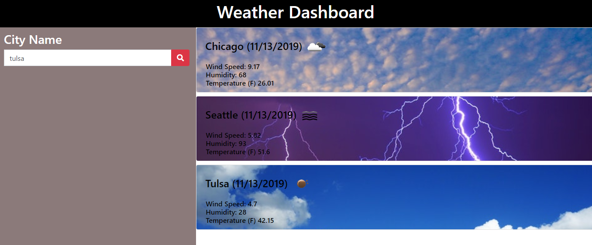

# Homework-06-Server-Side-APIs
Weather dashboard application
 with search functionality to find current weather conditions for multiple cities. 

## Table of contents
* [General info](#general-info)
* [Instruction](#instructions)
* [Screenshots](#screenshots)
* [Features](#features)

## General info
Build a weather dashboard application with search functionality to find current weather conditions for multiple cities.

## Instructions
As a traveler
I want to see the weather outlook for multiple cities
so that I can plan a trip accordingly

## Screenshots

## Features
List of features ready and TODOs for future development
* Use the OpenWeather API to retrieve weather data for cities. 
* Use AJAX to hook into the API to retrieve data in JSON format.
* Use dynamically updated HTML and CSS powered by jQuery.
* Icon image and card background image changes dynamically as a visual representation of weather conditions

To-do list:
* Include a 5-Day Forecast below the current weather conditions.
* Include a search history so that users can access their past search terms